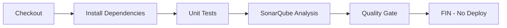
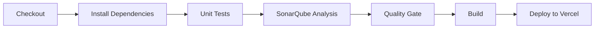

# 🏗️ Pokédex PWA - CI/CD Pipeline

Aplicación web progresiva de Pokédex con pipeline completo de CI/CD usando Docker, Jenkins y SonarQube.

## 📋 Características

### ✅ FASE 1: Aplicación PWA
- **API Consumption**: Integración con PokeAPI (30+ Pokémon)
- **PWA Features**: Manifest.json, Service Worker, Offline capability
- **Push Notifications**: Notificaciones nativas al seleccionar Pokémon
- **Responsive Design**: Funciona en desktop y móvil

### ✅ FASE 2: Infraestructura CI/CD
- **Docker Compose**: Servicios orquestados (Jenkins + SonarQube)
- **Jenkins**: Pipeline declarativo con gestión de ramas
- **SonarQube**: Análisis de código estático y Quality Gates

### ✅ FASE 3: Pipeline Declarativo
- **Branch Strategy**:
  - `develop`: Tests + SonarQube (sin despliegue)
  - `main`: Tests + SonarQube + Despliegue a producción
- **Quality Gate**: Bugs=0, Vulnerabilidades=0, Cobertura≥50%

### ✅ FASE 4: Despliegue Headless
- **Vercel CLI**: Despliegue programático sin integración Git
- **Credenciales Seguras**: Tokens inyectados como secrets
- **Project Linking**: Configurado para evitar prompts interactivos

## 🚀 Inicio Rápido

### 1. Clonar el repositorio
```bash
git clone https://github.com/Blxckbxll24/pokedexPWA.git
cd pokedexPWA
```

### 2. Configurar entorno CI/CD
```bash
# Hacer ejecutable el script de inicialización
chmod +x init-cicd.sh setup-sonarqube.sh

# Iniciar servicios
./init-cicd.sh
```

### 3. Configurar SonarQube (Inicial + Manual)
```bash
# Verificar y completar configuración inicial
./setup-sonarqube-initial.sh

# Después de configurar en el navegador, configurar Quality Gate
./setup-sonarqube-manual.sh

# Verificar configuración
./verify-sonarqube.sh
```

### 6. Probar Pipeline Completo
```bash
# Ver instrucciones completas de prueba
./test-pipeline.sh
```

## 🔧 Configuración Manual

### Variables de Entorno Requeridas
```bash
# En Jenkins > Manage Credentials > Add Credentials
VERCEL_TOKEN=tu_token_de_vercel
VERCEL_ORG_ID=tu_org_id
VERCEL_PROJECT_ID=tu_project_id
```

### Quality Gate en SonarQube
Accede a http://localhost:9000 (admin/admin) y verifica:
- Quality Gate "Pokédex Strict Gate" como defecto
- Condiciones: Bugs=0, Vulnerabilidades=0, Cobertura≥50%

## 📊 Pipeline de CI/CD

### Rama `develop`


### Rama `main`


## 🧪 Demostración (FASE 5)

### Paso 1: Fallo Intencional en `develop`
```bash
# Crear rama develop
git checkout -b develop

# Introducir error intencional (ejemplo)
echo "console.log('error')" > src/App.js

# Push y ver pipeline fallar en Quality Gate
git add . && git commit -m "feat: error intencional"
git push origin develop
```

### Paso 2: Éxito en `develop`
```bash
# Corregir error
git revert HEAD

# Push y ver pipeline pasar (sin deploy)
git push origin develop
```

### Paso 3: Despliegue a Producción
```bash
# Merge a main
git checkout main
git merge develop
git push origin main

# Ver despliegue completo en Jenkins
```

### Paso 4: Auditoría Final
1. **Instalación PWA**: Verificar "Add to Home Screen"
2. **Notificaciones**: Seleccionar Pokémon → Push notification
3. **Offline**: Modo avión → Recargar página

## 🛠️ Tecnologías Utilizadas

### Frontend
- **React 18**: Framework principal
- **PWA**: Service Worker + Manifest
- **Material Design**: UI/UX consistente

### Backend/Infrastructure
- **Docker**: Contenedorización completa
- **Jenkins**: Automatización CI/CD
- **SonarQube**: Análisis de calidad
- **Vercel**: Despliegue headless

### APIs
- **PokeAPI**: Datos de Pokémon
- **Notification API**: Push notifications nativas

## 📁 Estructura del Proyecto

```
pokedexPWA/
├── src/                    # Código fuente React
├── public/                 # Assets estáticos + PWA
├── docker-compose.yml      # Orquestación de servicios
├── Dockerfile.jenkins      # Jenkins personalizado
├── Jenkinsfile            # Pipeline declarativo
├── setup-complete.sh            # Setup maestro completo
├── setup-github-webhook.sh     # Configuración webhook GitHub
├── setup-jenkins-credentials.sh # Configuración credenciales Jenkins
├── setup-sonarqube-initial.sh   # Configuración inicial SonarQube
├── setup-sonarqube-manual.sh    # Configuración manual Quality Gate
├── setup-sonarqube.sh           # Script automático (legacy)
├── test-pipeline.sh             # Pruebas del pipeline
├── verify-sonarqube.sh          # Verificación configuración
└── README.md               # Esta documentación
```

## 🔐 Seguridad

- **Credenciales**: Almacenadas como secrets en Jenkins
- **Tokens**: Nunca expuestos en código
- **Quality Gates**: Prevención de despliegues con vulnerabilidades
- **Branch Protection**: Solo main puede desplegar

## 🚨 Troubleshooting

### Jenkins no inicia
```bash
# Ver logs
docker-compose logs jenkins

# Reiniciar servicio
docker-compose restart jenkins
```

### SonarQube no responde
```bash
# Verificar estado
curl http://localhost:9000/api/system/status

# Reiniciar
docker-compose restart sonarqube
```

### Pipeline falla
```bash
# Ver logs en Jenkins UI
# Verificar credenciales de Vercel
# Verificar conectividad de red
```

## 📞 Soporte

Para issues relacionados con:
- **PWA**: Verificar `src/` y `public/`
- **CI/CD**: Verificar `Jenkinsfile` y logs
- **Docker**: Verificar `docker-compose.yml`
- **SonarQube**: Verificar configuración de Quality Gates

## 🎯 Próximos Pasos

- [ ] Configurar webhooks GitHub → Jenkins
- [ ] Agregar tests de integración
- [ ] Implementar blue-green deployment
- [ ] Agregar monitoreo con Prometheus/Grafana

---

**Estado**: ✅ Listo para demostración completa
**Versión**: 1.0.0
**Autor**: Blxckbxll24